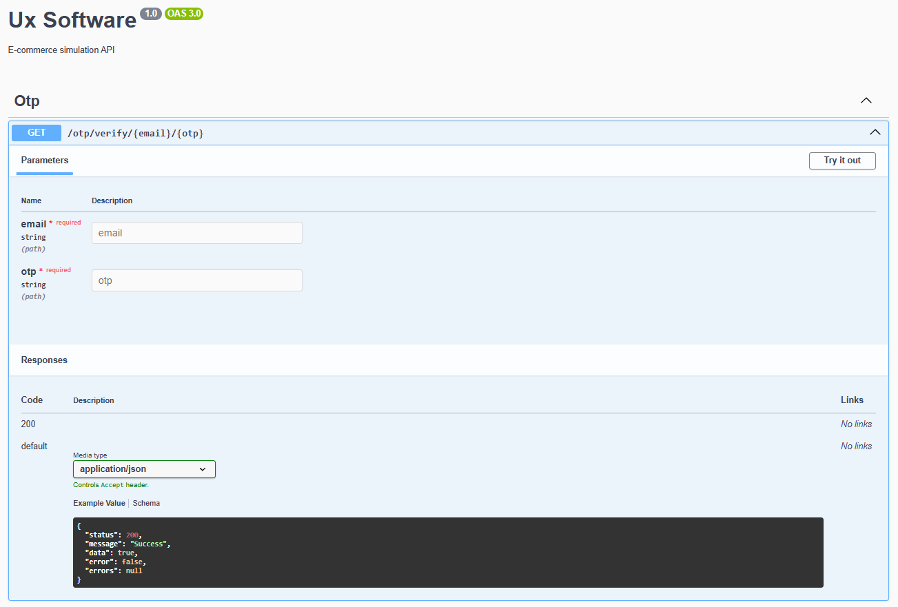
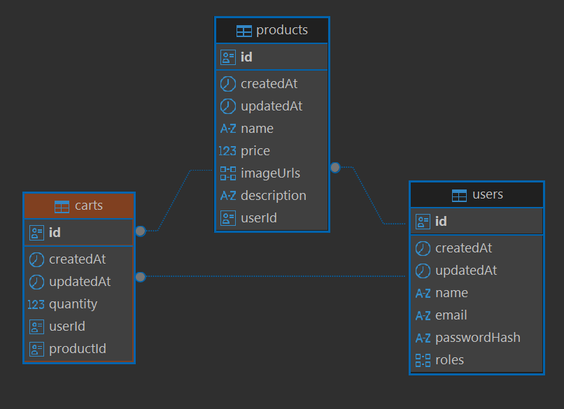

# UX Software Backend

API de e-commerce construída em NestJS com TypeORM (PostgreSQL), Redis, filas (Bull), envio de email (Mailer/Nodemailer) e documentação via Swagger. Inclui RBAC (Role-Based Access Control) básico, autenticação JWT, OTP (One-Time Password) por email, carrinho e produtos.

---

### 📃 Sumário

- [Requisitos](#️requisitos)
- [Como rodar](#como-rodar)
  - [Via Docker](#1-via-docker-recomendado)
  - [Local](#2-local-sem-docker)
  - [Online](#3-online)
- [Variáveis de ambiente](#variaveis-de-ambiente)
- [Features e endpoints](#features-e-endpoints)
- [Principais ferramentas](#principais-ferramentas)
- [Features e endpoints](#features-e-endpoints)
  - [Workspace Postman](#worspace-postman)
- [Migrations](#migrations)
- [Testes](#testes)
- [Database](#database)
- [Troubleshooting](#troubleshooting)
- [Pontos de melhoria](#pontos-de-melhoria)

---

## Requisitos

- Node.js 20+
- npm
- Docker e Docker Compose (opcional para execução com containers)
- PostgreSQL e Redis (se rodar localmente sem Docker)

---

## Como rodar

### 1) Via Docker (recomendado)

#### 1. Crie um arquivo `.env` na raiz (veja exemplo em [“Variáveis de ambiente”](#variaveis-de-ambiente)).

#### 2. Suba os containers:

```bash
make docker-up  ou  docker-compose up -d
# ou, se quiser garantir rebuild de imagens
make docker-up-build  ou  docker-compose up -d --build
```

#### 3. A API estará em `http://localhost:${API_PORT}` (veja `.env`).

#### 4. Documentação Swagger: `http://localhost:${API_PORT}/doc`.

#### Para parar os containers:

```bash
make docker-down  ou  docker-compose down
```

#### Logs do container da API:

```bash
make docker-logs  ou  docker logs ux-software-api
```

#### Notas:

- O serviço `api` expõe internamente a porta 3000. O mapeamento externo usa `${API_PORT}` do `.env`.
- Postgres e Redis também são provisionados via Compose.

### 2) Local (sem Docker)

#### 1. Crie um `.env` na raiz (veja exemplo em [“Variáveis de ambiente”](#variaveis-de-ambiente)).

#### 2. Instale dependências:

```bash
make install
# ou
npm install
```

#### 3. Execute as migrações:

```bash
make migrate
# ou
npm run migration:run
```

#### 4. Inicie em desenvolvimento:

```bash
make start
# ou
npm run start:dev
```

#### 5. Acesse:

- API: `http://localhost:${API_PORT}` (default 3000)
- Swagger: `http://localhost:${API_PORT}/doc`

### 3) Online

Esse projeto foi publicado na vercel e está disponível na rota: https://ux-software-backend.vercel.app

---

## Variaveis de ambiente

**O arquivo .env.example também contém as variáveis necessárias.**

Crie um `.env` na raiz. Exemplo mínimo funcional:

```bash
# API
API_PORT=3000
TOKEN_EXPIRATION="1d"
SECRET_KEY=secret_key

# PostgreSQL
# Caso esteja utilizando docker, substituir o host por 'db' -> POSTGRES_HOST=db
POSTGRES_HOST=localhost
POSTGRES_PORT=5432
POSTGRES_USER=postgres
POSTGRES_PASSWORD=postgres
POSTGRES_DB=ux_software

# Redis
# Caso esteja utilizando docker, substituir o host por 'redis' -> REDIS_HOST=redis
REDIS_HOST=localhost
REDIS_PORT=6379

# E-mail (opcional)
# Se qualquer uma dessas faltar, será gerada uma conta de teste (Ethereal) automaticamente.
MAIL_FROM="UX Software <no-reply@uxsoftware.com>"
MAIL_HOST=smtp.example.com
MAIL_PORT=587
MAIL_USER=your_user
MAIL_PASSWORD=your_password
```

### Observações:

- O `DatabaseConfigService` exige: `POSTGRES_HOST`, `POSTGRES_PORT`, `POSTGRES_USER`, `POSTGRES_PASSWORD`, `POSTGRES_DB`.
- `Redis` usa `REDIS_HOST` e `REDIS_PORT`.
- `Mailer` usa `MAIL_*` mas, se faltar, gera credenciais de teste automaticamente e loga um aviso.

---

## Principais ferramentas

- **NestJS**;
- **TypeORM**;
- **PostgreSQL**;
- **Redis + @nestjs/bull (Bull)**;
  - filas para processamento assíncrono (ex.: envio de e-mails/OTP) sem travar o request/response.
- **@nestjs-modules/mailer + Nodemailer**:
  - envio de e-mails;
- **@nestjs/swagger**;
  - documentação auto-gerada de endpoints em `/doc`.
- **class-validator / class-transformer**;
  - validação e transformação declarativa de DTOs.
- **JWT (@nestjs/jwt)**;
  - autenticação stateless.
- **ESLint + Prettier + ts-jest + Jest**;
  - qualidade de código e testes.
- **Docker/Docker Compose**;
  - padronização do ambiente (API, Postgres, Redis).
- **Makefile**;
  - conveniência para comandos frequentes (subir Docker, rodar migrations, etc).

---

## Features e endpoints

> #### Worspace Postman:
>
> _está na pasta ./assets/UxSoftware Tests.postman_collection_
>
> - [postman-collection.json](./assets/UxSoftware%20Tests.postman_collection.json)

- **Autenticação e RBAC**
  - Login: `POST /auth/login` (retorna token JWT).
  - `JwtAuthGuard` aplicado globalmente; use o decorator `@Public()` para rotas públicas.
  - `@Roles(...)` + `PermissionGuard` para autorização baseada em role (ex.: ADMIN).
- **Usuários (`/users`)**
  - `POST /users`: cria usuário (público).
  - `GET /users/:id`: obtém usuário (requer JWT).
  - `PATCH /users`: atualiza roles do usuário autenticado (requer JWT).
- **Produtos (`/products`)**
  - `POST /products`: cria produtos em lote (apenas ADMIN).
  - `GET /products/:id`: busca por id (público).
  - `GET /products`: lista com paginação (público).
  - `PATCH /products/:id`: atualiza (ADMIN).
  - `DELETE /products/:id`: remove (ADMIN).
- **Carrinho (`/carts`)**
  - `POST /carts`: adiciona produto ao carrinho (JWT).
  - `GET /carts`: lista carrinho do usuário (JWT, paginação).
  - `PATCH /carts`: altera quantidade (JWT).
  - `PATCH /carts/remove`: remove itens (JWT).
- **OTP e e-mail**
  - Módulo `otp` expõe endpoints para envio/validação de OTP por e-mail.
  - Fila `SEND_OTP_EMAIL` via Bull/Redis para processamento assíncrono.

**Documentação interativa:** `GET /doc`



---

## Migrations

- Gerar migration:
  ```bash
  make migration-generate MIGRATION_NAME=CreateUsersTable
  # ou
  npm run migration:generate --name=CreateUsersTable
  ```
- Rodar migrations:
  ```bash
  make migrate
  # ou
  npm run migration:run
  ```
- Reverter última:
  ```bash
  make migrate-revert
  # ou
  npm run migration:revert
  ```
- Listar migrations:
  ```bash
  make migration-show
  # ou
  npm run migration:show
  ```

Obs.: O CLI do TypeORM usa `src/infra/database/datasource.ts`.

---

## Database

- O usuário (ADMIN) poderá ter vários produtos 1:N;
- O usuário poderá ter vários produtos no carrinho 1:N;
- O carrinho poderá ter vários produtos 1:N.



---

## Testes

- Unit tests:
  ```bash
  make run-test
  # ou
  npm run test
  ```
- Watch:
  ```bash
  npm run test:watch
  ```
- Cobertura:
  ```bash
  npm run test:cov
  ```
- E2E:
  ```bash
  npm run test:e2e
  ```

---

## Troubleshooting

- **Erro “Config error - missing env.POSTGRES\_\*”:** faltam variáveis no `.env`. Verifique seção “Variáveis de ambiente”.
- **Porta ocupada:**
  - Ajuste `API_PORT`, `POSTGRES_PORT` ou `REDIS_PORT` no `.env`.
  - Pare serviços locais de Postgres/Redis se estiver usando Docker.
- **E-mail não enviado:**
  - Sem `MAIL_*`, o sistema gera uma conta de testes (Ethereal) automaticamente e loga as credenciais. Use-as para visualizar e-mails.
- **Swagger não carrega:**
  - Confirme que a API está rodando e acesse `http://localhost:${API_PORT}/doc`.

---

## Pontos de melhoria

- **Testes:** Deixei os testes bem básicos e só tem testes das services;
- **Refresh Token:** Não fiz a implementação do refresh token;
- **Filtros de rotas:** Não fiz a implementação dos filtros, como por exemplo, buscar produtos por nome, ordenar por preço...
- **Verificação de validação do email:** Não implementei nenhuma verificação para identificar se o usuário verificou o email. Acredito que isso seja algo para ser definido nas regras de negócio, talvez nesse escopo não faça tanto sentido. Mas se tivesse a parte de checkout, por exemplo, talvez fizesse sentido, assim poderia barrar algumas ações do usuário caso ele não tivesse validado o email.

---
